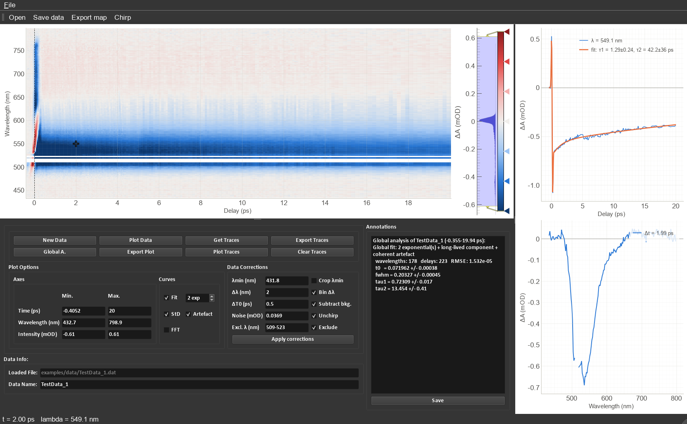
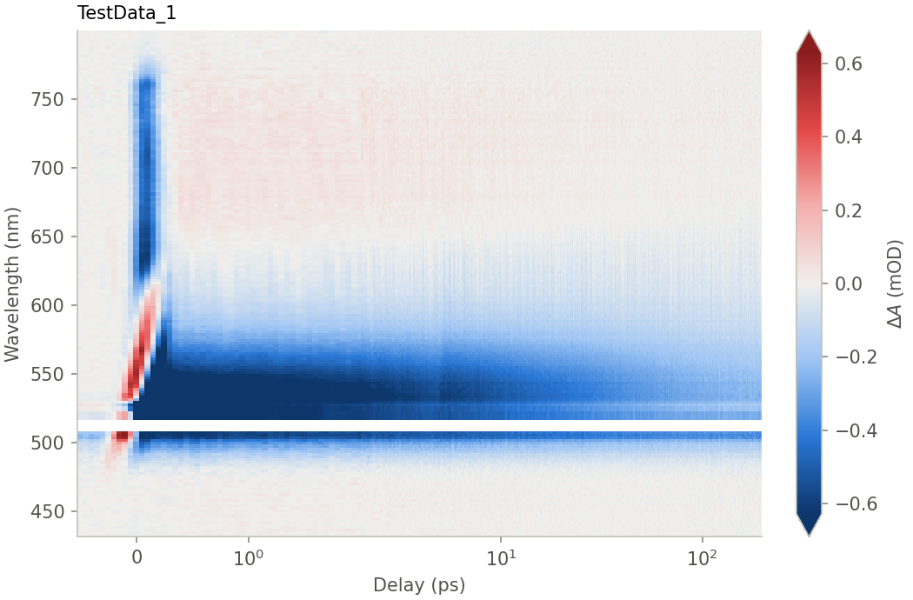
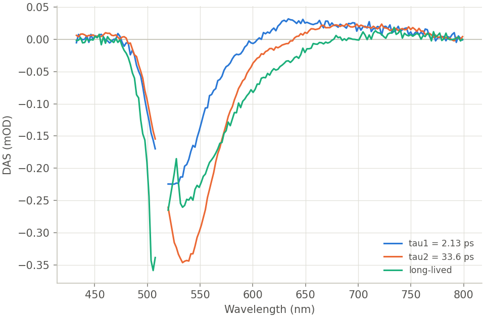
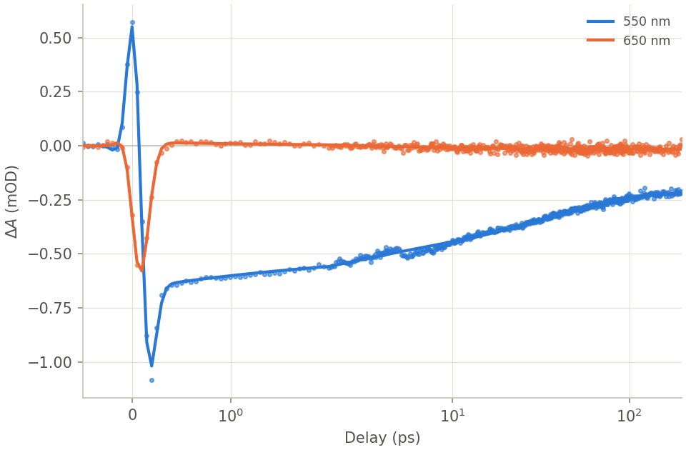
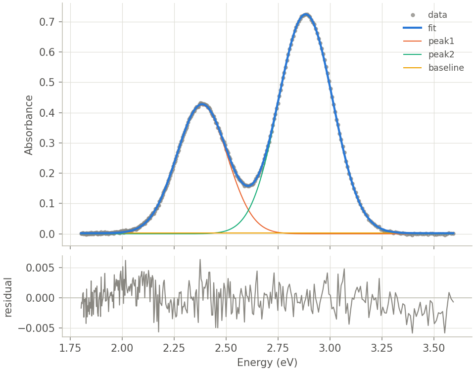
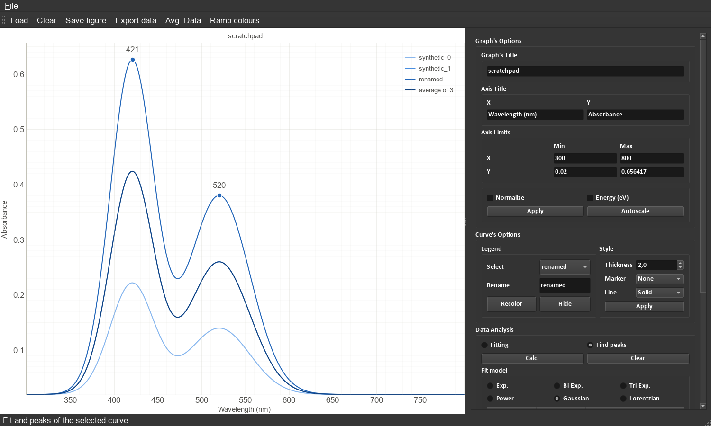

# Spectroscopy Toolset

[](https://github.com/ferrod29/SpectroscopyToolset/actions/workflows/tests.yml)

Python tools for inspecting and analysing **UV-vis absorption** spectra and
**transient-absorption (TA, pump-probe)** data. The package has three parts:

* a tested analysis library (`import spectroscopy_toolset as st`);
* a command-line tool (`spectro`) for scripted, reproducible analyses;
* two desktop interfaces: the **UV-vis Plotter** and the **TA Inspector**.



## Features

**Steady-state UV-vis**

* Robust reader for instrument exports: tab, comma, semicolon or whitespace
  separated, decimal comma, header and footer lines, descending wavelengths,
  and multi-sample `x,y,x,y` (Cary-style) files.
* Baselines: asymmetric least squares, a polynomial through band-free regions,
  or a constant offset. Also Savitzky-Golay smoothing and derivatives,
  normalisation, conversion to an energy axis, and averaging on a common grid.
* Peak table with positions, heights, prominences and widths.
* Band deconvolution with Gaussian, Lorentzian or pseudo-Voigt bands, an
  optional baseline, and standard errors for every parameter.
* Beer-Lambert quantification: calibration curves with slope/intercept errors,
  ε, LOD and LOQ, and prediction of unknowns.
* Optical band gaps from Tauc plots (direct or indirect, allowed or forbidden),
  with automatic detection of the linear region.

**Transient absorption**

* `TAData` container: crop, exclude pump scatter, subtract the pre-time-zero
  background, estimate noise, bin wavelengths, cut kinetics and spectra, SVD,
  and average repeated scans (with standard errors).
* Chirp (group-velocity dispersion) correction: time zero estimated per
  wavelength from the coherent artefact, a robust polynomial fit, and
  per-wavelength re-interpolation.
* Kinetic fits: sums of exponentials convolved with a Gaussian IRF, an optional
  long-lived component, and an optional **coherent-artefact** term. Variable
  projection makes the fits insensitive to starting values.
* **Global analysis**: lifetimes shared across all wavelengths, giving
  decay-associated spectra (DAS). These convert to evolution-associated spectra
  (EADS) for a sequential A → B → C scheme.
* Coherent-oscillation spectra (Lomb-Scargle on non-uniform delay grids), with
  a correct frequency axis in cm⁻¹.
* Publication-style figures, including maps on the true non-uniform delay grid
  with an optional symmetric-log time axis.

<p float="left">
  
  
  
  
</p>

## Installation

Requires Python ≥ 3.9.

```bash
git clone https://github.com/ferrod29/SpectroscopyToolset.git
cd SpectroscopyToolset
pip install -e ".[gui]"      # library + CLI + desktop interfaces
# pip install -e .           # library + CLI only (no Qt)
# pip install -e ".[gui,dev]"  # + pytest and ruff for development
```

In a conda environment, install the dependencies from conda first
(`conda install numpy scipy pandas matplotlib pyqt pyqtgraph`), then run
`pip install -e . --no-deps`.

## Quick start

### Python

```python
import spectroscopy_toolset as st

# --- UV-vis -------------------------------------------------------------
spec = st.read_spectrum("sample.csv").crop(300, 800)
spec = spec.subtract_baseline("poly", degree=2, regions=[(300, 330), (700, 800)])
print(spec.find_peaks())                                  # DataFrame of bands
bands = spec.to_energy().fit_peaks(n_peaks=2, baseline="constant")
print(bands)                                              # values +/- errors

cal = st.uvvis.calibration_curve([5e-6, 1e-5, 2e-5, 4e-5], [0.061, 0.12, 0.24, 0.49])
print(cal.molar_absorptivity, cal.lod, cal.concentration(0.30))

gap = st.uvvis.tauc_bandgap(spec.x, spec.y, transition="direct")
print(gap)                                                # Eg = ... eV

# --- Transient absorption ------------------------------------------------
ta = st.read_ta(["scan1.dat", "scan2.dat"])               # averaged, with std. errors
ta = (ta.shift_time(ta.delays[0])
        .exclude_wavelengths((509, 523))                  # pump scatter
        .subtract_background(before=0.45))                # pre-time-zero signal
wl, t0 = ta.estimate_chirp(window=(0.3, 1.5))
ta = ta.correct_chirp(st.fit_chirp(wl, t0)).bin_wavelengths(width=2.0)

fit = ta.fit_kinetics(550, width=5, n_exp=2, step=True, artifact=3)
print(fit["tau1"], fit.errors["tau1"])

result = ta.global_fit(n_exp=2, step=True, artifact=3)
print(result)                                             # lifetimes +/- errors
das, eads = result.das, result.eads()

from spectroscopy_toolset import plotting
plotting.plot_ta_map(ta, linthresh=2.0)
plotting.plot_das(result)
```

For complete worked examples, see [`examples/uvvis_analysis.py`](examples/uvvis_analysis.py)
(synthetic dilution series and film) and [`examples/ta_analysis.py`](examples/ta_analysis.py)
(the TA example data).

### Command line

Every command writes PNG figures when `--out` is given and opens interactive
windows otherwise. Run `spectro <command> -h` for all options.

| Command | Purpose |
|---------|---------|
| `spectro uvvis FILES... [--baseline als\|poly\|offset] [--peaks] [--energy]` | plot/process spectra, list peaks |
| `spectro deconvolve FILE --n-peaks N [--shape gaussian] [--energy]` | band deconvolution |
| `spectro tauc FILE [--transition direct] [--range EMIN EMAX]` | Tauc band gap |
| `spectro calibrate --conc ... --abs ... [--unknown A]` | Beer-Lambert calibration, LOD/LOQ |
| `spectro ta FILES... [--kinetics NM...] [--fit N] [--spectra PS...]` | TA map, kinetics (fitted), spectra |
| `spectro ta-global FILES... --n-exp N [--step] [--artifact 3] [--eads]` | global analysis (DAS/EADS) |
| `spectro ta-export FILES... --xyz OUT \| --matrix OUT` | export processed TA data |

The TA commands share pre-processing options, applied in this order:
`--zero-first`, `--t0`, `--exclude MIN MAX`, `--wl-range`,
`--background-before T`, `--chirp [--chirp-window T0 T1]`, `--bin NM`,
`--t-range`. For example:

```bash
spectro ta-global examples/data/TestData_1.dat --zero-first --exclude 509 523 \
    --background-before 0.45 --chirp --chirp-window 0.3 1.5 --bin 2 \
    --n-exp 2 --step --artifact 3 --eads --linthresh 2 --out results/testdata1
```

### Desktop interfaces

```bash
spectro-uvvis [files...]    # UV-vis Plotter
spectro-ta [files...]       # TA Inspector (suite window + one inspector per data set)
```

**UV-vis Plotter**: load any number of spectra, then style curves (colour
picker, width, marker, line style, hide/show, rename) and normalise or switch
to an energy axis. It can average curves on a common grid, find peaks, and fit
exponential, power-law, Gaussian or Lorentzian models inside the x-axis limits.
The fit panel has editable starting values and shows the fitted values ±
errors. Figures export to PNG/SVG and data to CSV. Results are logged to the
notes box.



**TA Inspector**: *Data Corrections* crops λ < λmin, excludes bands (e.g. pump
scatter), subtracts the signal recorded before ΔT0, reports the noise, corrects
the chirp and bins wavelengths. The map shows the true delay axis with a
zero-centred diverging colour scale, whose limits are the *Intensity* fields.
Click the map to see the kinetic trace and spectrum at that point:

* *Fit* fits n exponentials + IRF (+ coherent artefact with *Artefact*).
* *StD* shows standard-error bars (when several scans were averaged).
* *FFT* shows the oscillation spectrum of the fit residuals.

*Get/Plot Traces* collect traces for comparison, and *Export Traces* sends
normalised traces to the suite window to compare data sets. *Global A.* runs
the global analysis of the displayed region and opens the DAS/EADS.

## Analysis methods

| Method | Notes |
|--------|-------|
| Asymmetric least-squares baseline | Eilers & Boelens (2005). `lam` sets the stiffness, `p` the asymmetry. |
| Peak widths | Measured at half prominence, which equals the FWHM for an isolated band on a flat baseline. Use `fit_peaks` for overlapping bands. |
| Band deconvolution | Non-linear least squares (trust-region reflective). Standard errors come from the covariance matrix scaled by the reduced χ², and parameters that end at a bound are flagged. |
| Calibration | Ordinary least squares. LOD = 3.3 s_res/slope, LOQ = 10 s_res/slope (ICH Q2). |
| Tauc plot | Fits (αhν)ⁿ vs hν with n = 2 (direct), ½ (indirect), ⅔, ⅓ (forbidden). α = ln10·A/d if a thickness is given. Automatic mode picks the steepest window with R² ≥ 0.99. |
| IRF-convolved exponentials | Exact analytic convolution of exp(−t/τ) with a Gaussian, evaluated with `erfcx` so it never overflows. |
| Coherent artefact | The Gaussian IRF and its first and second derivatives, with amplitudes solved linearly (as in Glotaran). |
| Chirp | Time zero per wavelength bin from the half-rise of the first strong signal (or its maximum or steepest slope), then a robust (soft-L1) polynomial in (λ−λc)/100 nm. Traces are re-interpolated onto t + t0(λ). |
| Global analysis | Variable projection (Golub & Pereyra 2003): DAS are solved by linear least squares at every trial set of (t0, FWHM, τ). An SVD compression makes this exact and fast. EADS follow from the sequential-scheme coefficient matrix (van Stokkum et al. 2004). |
| Oscillations | Lomb-Scargle periodogram on non-uniform delays with a time-domain Hann taper. Wavenumbers use ω = 2πc·ν̃ with c = 0.02998 cm/ps. |

References: P. H. C. Eilers & H. F. M. Boelens, *Baseline correction with asymmetric
least squares smoothing* (2005); J. Tauc, R. Grigorovici & A. Vancu, *Phys. Status
Solidi* **15**, 627 (1966); G. H. Golub & V. Pereyra, *Inverse Problems* **19**, R1 (2003);
I. H. M. van Stokkum, D. S. Larsen & R. van Grondelle, *Biochim. Biophys. Acta* **1657**,
82 (2004); S. A. Kovalenko et al., *Phys. Rev. A* **59**, 2369 (1999); M. Lorenc et al.,
*Appl. Phys. B* **74**, 19 (2002); N. R. Lomb, *Astrophys. Space Sci.* **39**, 447 (1976);
J. D. Scargle, *Astrophys. J.* **263**, 835 (1982).

## Data formats

* **Spectra**: any delimited text file with numeric columns, where the first
  column is x (see `read_spectrum` / `read_spectra`).
* **TA matrices** (`.dat`, `.txt`, `.csv`): the first row holds the delays
  after a corner cell, the first column the wavelengths, and the rest ΔA in
  OD. Use `transpose=True` / `--transpose` for the opposite orientation and
  `time_scale` / `--time-scale` to convert delays to ps.
* **`.scan`** (JSON): `[[wavelengths], [delays in fs], ΔA[delay][wavelength], [background]]`.
* **Export**: `write_ta_matrix` uses the same matrix layout. `write_ta_xyz`
  writes `wavelength delay value` triplets in blocks (gnuplot `splot`/`pm3d`,
  Origin XYZ).

The example data are described in [`examples/data/README.md`](examples/data/README.md).

## Project layout

```
src/spectroscopy_toolset/
    io.py           readers/writers (spectra, TA matrices, .scan, xyz)
    spectrum.py     Spectrum container (UV-vis)
    uvvis.py        peaks, deconvolution, Beer-Lambert, Tauc
    transient.py    TAData container, chirp correction, oscillations
    fitting.py      generic fits, kinetic fits, global analysis, DAS/EADS
    models.py       band shapes and kinetic models
    processing.py   units, binning, smoothing, baselines, normalisation, resampling
    plotting.py     matplotlib figures
    cli.py          `spectro` command
    gui/            Qt interfaces (uvvis_plotter.py, ta_inspector.py, ui/*.ui)
examples/           worked examples and example data
tests/              pytest suite (run `pytest`)
```

## Development

```bash
pip install -e ".[gui,dev]"
pytest                          # tests; the GUI tests run offscreen
ruff check src tests && ruff format --check src tests
```

The `.ui` files open in Qt Designer. Widget names are part of the interface
code, so rename them in both places.

## Migrating from the legacy scripts

| Legacy file | Replacement |
|-------------|-------------|
| `uv-vis_plotter.py` | `spectro-uvvis`, `spectroscopy_toolset.gui.uvvis_plotter` |
| `TASGUI.py` + `DataHandler.py` | `spectro-ta`, `spectroscopy_toolset.gui.ta_inspector` (+ `transient`, `fitting`) |
| `snippets.py` | `spectroscopy_toolset.models`, `processing.bin_mean` |
| `data3dtransform.py` | `spectro ta-export --xyz`, `TAData.save_xyz` |

The legacy scripts remain in the git history. [`CHANGELOG.md`](CHANGELOG.md)
lists the bugs fixed along the way; several of them changed results, for
example the tri-exponential fit, the map time axis and multi-file averaging.
